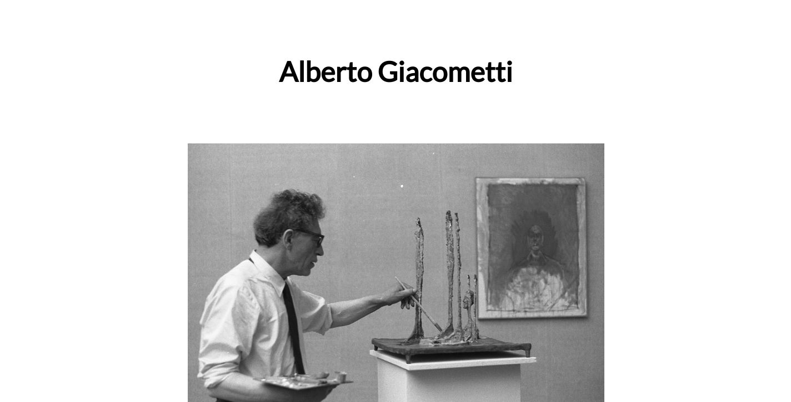

# Tribute Page

## Introduction
A tribute page to the swiss artist Alberto Giacometti.

This project is part of freeCodeCamps Responsive Web Design certificate.

## Project Requirements
* The tribute page should have an element with a corresponding id="main", which contains all other elements.
* There is an element with a corresponding id="title", which contains a string (i.e. text) that describes the subject of the tribute page (e.g. "Dr. Norman Borlaug").
* There is a div element with a corresponding id="img-div".
* Within the img-div element is an img element with a corresponding id="image".
* Within the img-div element is an element with a corresponding id="img-caption" that contains textual content describing the image shown in img-div.
* There is an element with a corresponding id="tribute-info", which contains textual content describing the subject of the tribute page.
* There is an element with a corresponding id="tribute-link", which links to an outside site that contains additional information about the subject of the tribute page. HINT: You must give your element an attribute of target and set it to _blank in order for your link to open in a new tab (i.e. target="_blank").
* The img element should responsively resize, relative to the width of its parent element, without exceeding its original size.
* The img element should be centered within its parent element.

## Final Project
https://myrmidonut.github.io/fcc_responsive_tribute

## Preview Images
### Main Screen:

